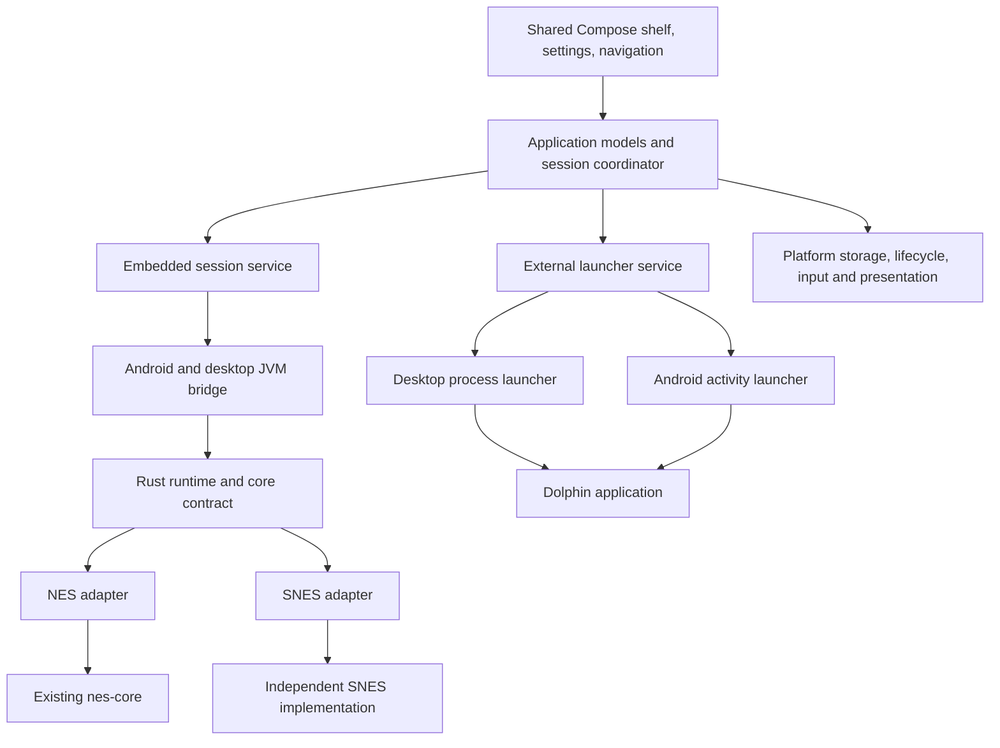

# Emulia multisystem feasibility and architecture

**Required SNES feature parity.** Rewind, fast-forward, and save states are mandatory on Android and the shared desktop GUI for either implementation path. A core that merely boots games or exposes serialization is not qualified. These requirements apply to embedded NES/SNES sessions; the separately launched Dolphin model retains the limitations described below. Core selection remains open until both approaches are compared against these requirements.

**Verdict.** A separate SNES core, a shared Android/desktop GUI, and external Dolphin launching are all technically feasible. They require different integration boundaries. Preserve `nes-core`; add an embedded-core contract for NES and SNES; extract the Compose application UI into shared code; implement Dolphin as an external launcher. Dolphin remains responsible for its gameplay display, input configuration, and saves. A seamless Emulia-owned Dolphin gameplay overlay is outside the simple launcher approach.

This assessment is anchored to repository commit `d3d0b351d9736ee74746074fdffcebb800d8deef`, inspected September 12, 2026. Upstream references were accessed on the same date. The working tree was clean before these documents were added. Conclusions distinguish inspected implementation from proposals; no SNES adapter, GUI port, performance benchmark, or Dolphin device launch was implemented or validated for this report. Repository documentation describes existing test results; those results were not rerun here.

Assume Android remains the primary product, with macOS and Linux as the first desktop GUI targets because they already have repository build support. Windows is feasible but should be a separately accepted packaging and device-testing target. The confirmed SNES direction is to compare integrating an upstream emulator with writing an independent core before deciding. An existing core is the conditional recommendation for playable SNES support soon, not a selected implementation. No upstream license or product relicensing decision is presumed approved.

| Requested feature | Assessment | Main condition | Confidence |
|---|---|---|---|
| Preserve the NES emulator while supporting other systems | Feasible | Put adapters around cores, not SNES branches inside NES hardware | High |
| Embed an existing SNES core on Android and desktop | Feasible, candidate-dependent | License selection, Android build and performance proof | High on architecture; medium on untested candidate |
| Write a new independent SNES core | Feasible as a substantial emulator project | Incremental compatibility goals and sustained development | High technically; low schedule certainty |
| Reuse Android GUI for SNES | Feasible | Remove NES assumptions from session, media, controls, and storage | High |
| Share the full GUI with desktop | Feasible with extraction | Compose Multiplatform plus platform services and a desktop player surface | High framework feasibility; medium delivery risk |
| Launch Dolphin on desktop | Feasible | Executable discovery, arguments, process supervision | High |
| Launch Dolphin on Android | Feasible in inspected source | Exported main activity, readable content URIs, device/version validation | High source evidence; medium deployment confidence |
| Use Emulia pause menu, rewind, shaders, and saves inside Dolphin | Not provided by simple launching | Would need additional supported integration or a maintained fork | High |

**The existing separation is good at the core boundary and incomplete at the application boundary.** `core/` is a dependency-free Rust NES implementation. Its public API exposes `Nes`, cartridge and controller types; its stated contract excludes platform I/O and threads. Android JNI/AAudio and desktop SDL already live outside it. That is a sound starting point. The reusable part is the emulation architecture, not the NES CPU, PPU, or APU implementation. [Repository core](../core/src/lib.rs), [workspace](../Cargo.toml).

The Android UI consists of approximately 3,317 Kotlin lines, including a 1,392-line `MainActivity.kt` and a 513-line GL renderer. The activity mixes Compose screens, import, native calls, bitmap handling, persistence, lifecycle, and play orchestration. `Ui.kt` is a much cleaner collection of Compose design primitives. The amount of code is manageable, but sharing the actual application means extracting responsibilities rather than moving one already-portable GUI module. [Activity](../android/app/src/main/java/dev/androidemu/MainActivity.kt), [UI primitives](../android/app/src/main/java/dev/androidemu/Ui.kt).

The desktop program is a separate Rust/SDL player, not a desktop build of the Android GUI. It lacks the Android shelf, picture settings, controller mapping, and rewind controls. Its existing audio scheduling, atomic save handling, and CI coverage are useful references and a migration safety net. [Desktop implementation](../desktop/src/main.rs), [desktop feature documentation](DESKTOP.md).

| Inspected location | Current coupling | Consequence for the change |
|---|---|---|
| `native/src/lib.rs` | Global `Mutex<Option<Nes>>`, NES palette conversion, fixed RGBA capacity | Wrap a session runtime; make frame descriptors explicit |
| `Native.kt` | Singleton NES-oriented calls, palette and header-note APIs | Add typed descriptors and capabilities; keep JNI exports compatible initially |
| `GameSurface.kt` | Android GL/lifecycle and native stepping together | Separate session commands from Android presentation |
| `Picture.kt`, `ScreenRenderer.kt` | NES width/height, cropping, texture geometry | Drive geometry and shader uniforms from video metadata |
| `native/src/audio.rs`, desktop audio | 48 kHz mono and sample-count assumptions | Define channels, sample frames, buffering, resampling explicitly |
| `ControllerInput.kt`, activity touch controls | NES buttons and two-player shape | Map physical controls to per-system logical controls |
| `Library.kt` | `game.nes`, no system/backend fields, 16 MiB byte-array import limit | Version library records and distinguish cartridge copies from disc references |
| `Settings.kt` | Android preferences plus Compose state | Separate settings model, persistence, and system-specific options |
| `core/src/rewind.rs` | Generic byte-delta algorithm physically inside NES crate | Reuse carefully; changing serialized lengths currently clears history |
| `core/src/state.rs` | `ANES` states, writer version 3, readers for versions 1–3 | Preserve existing NES decoding; add outer metadata for new systems |

**Recommended structure: one application, two backend kinds.** An embedded session produces frames and audio and accepts input, reset, and supported save operations. An external session starts another application and tracks the handoff. A Dolphin launcher should not pretend to implement `run_frame`, `serialize`, or Emulia rendering. This avoids a large interface whose methods are mostly unsupported for Dolphin.

Proposed Rust workspace additions are `emulation-api/`, `emulation-runtime/`, and `cores/nes-adapter/`, followed by `cores/snes-adapter/`. Leave `core/` and its package name in place. `emulation-api` depends on neither core; the NES adapter depends on it and `nes-core`; the runtime composes selected adapters. Preserve `runner/` as a NES accuracy tool. Keep `desktop/` operational while the shared GUI gains feature parity.

On the Kotlin side, add a shared UI/domain module with `commonMain`, Android implementations in `androidMain`, and desktop JVM implementations in `desktopMain`, plus a desktop application entry point. The exact Gradle directory names can be chosen during the migration. Avoid forcing a workspace-wide rename, brand change, or a stable third-party plugin ABI into the first phase.

Start with statically selected cores and a small Rust trait or enum. A dynamic core loader adds symbol loading, ABI versioning, packaging, and lifecycle constraints that are not necessary for two embedded systems. A libretro adapter can live behind this contract if the SNES candidate uses it; Emulia does not need to become RetroArch. Libretro provides a C callback boundary for video, audio, input, and optional serialization, but does not supply the application shell. [Libretro API overview](https://docs.libretro.com/development/cores/developing-cores/).[^1]

**The embedded contract should describe actual output.** Recommended concepts are `SystemId`, `CoreId`, `CoreVersion`, `CoreCapabilities`, `VideoFrameDescriptor`, `AudioFormat`, `InputState`, `ContentIdentity`, and versioned opaque state payloads. Keep hardware internals private to their core. Capability availability may depend on the loaded content as well as the implementation.

Video metadata should carry width, height, row stride in bytes, pixel format, visible rectangle, pixel aspect ratio, and presentation/interlace information. Support descriptor changes during play, validate dimensions and multiplication before accessing buffers, and resize presentation resources only when necessary. RGBA8888 is a practical initial host format: the NES adapter can perform its existing palette expansion, and the SNES adapter can normalize its output. Do not apply a selectable 64-entry NES palette to SNES color output.

SNES video is not universally 256×240. Design for low/high horizontal resolution and interlaced output, including buffers up to 512×478 for ordinary SNES modes, while treating the adapter descriptor as authoritative. Make crop and aspect settings system-specific; deriving the correct display shape is different from stretching every framebuffer to 4:3. SNES display modes, color operations, and register behavior are documented in the SNESdev PPU reference. [PPU registers](https://snes.nesdev.org/wiki/PPU_registers).[^2]

Audio should be interleaved samples with an explicit channel count and rate. Normalize NES mono to stereo at the host boundary if that simplifies the outputs. Queue depth and latency must be measured in audio frames, not scalar samples: a stereo frame contains two samples. Specify who owns resampling so a SNES adapter and host do not both resample unnecessarily. Preserve AAudio on Android and implement a desktop audio sink independent of the shared UI.

Use one emulation owner thread and a serialized command queue. Neither the Compose thread nor the real-time audio callback should run the emulator. Input is a snapshot of logical controls; rendering consumes the latest completed frame through bounded buffers. Save/load/reset must be ordered with frame stepping; restoring a state flushes queued audio and stale presentation frames. Returning from background should not replay a large accumulated frame backlog. These are proposed runtime rules, not claims about an already shared implementation.

SNES needs A/B/X/Y, L/R, Start/Select, and directions. Separate emulated shoulder buttons from the current rewind/fast-forward shortcuts: reusing the NES shoulder shortcut policy would consume real SNES gameplay inputs. Put shortcuts in an independent binding layer with explicit conflict handling. Keep port count and peripheral support describable, but ship ordinary pads first; mouse, multitap, light guns, and specialty devices each require separate acceptance.

**SNES implementation options.** There is no need to change `nes-core` to accommodate any of these. The decision primarily affects license obligations, adapter work, performance testing, and long-term maintenance.

| Candidate | Verified evidence | Fit and constraints | Recommendation |
|---|---|---|---|
| jgenesis SNES backend | Rust `snes-core` with separate CPU, coprocessor, configuration, DSP, and common crates; renderer/audio/input/save interfaces | Natural Rust integration; upstream workspace dependencies and API changes need isolation; Android support is not established by this audit | First Rust integration spike if GPL distribution is acceptable |
| Snes9x through a libretro adapter | Existing core wrapper and platform build machinery | Adds C/C++ and callback ownership work; custom noncommercial license must fit the product | Strong alternative when those terms are acceptable |
| bsnes | Feature-rich SNES implementation, including coprocessor support; GPLv3-or-later core | C++ integration and target-device performance need proof; desktop feature claims are not Android benchmarks | Reference/comparison candidate, not default commitment |
| New Rust SNES core | Full control over new implementation and APIs | CPU, graphics, audio, cartridge chips, timing, and conformance all become project work | Choose for emulator-development goals, not rapid platform expansion |

jgenesis advertises support for several important SNES coprocessors, including Super FX, SA-1, DSP-1, CX4, S-DD1, and SPC7110. This is an upstream feature claim, not proof that every corresponding title will work in an Emulia adapter. Its README identifies GPLv3 licensing. [jgenesis README](https://github.com/jsgroth/jgenesis).[^3] Its API has a `SnesEmulator`, save-state encoding support, callbacks for host services, and configurable audio output frequency. The inspected Cargo manifest uses Rust edition 2024 and several workspace crates; adopting it is more than copying one source directory. [SNES API](https://github.com/jsgroth/jgenesis/blob/b1419eface3147568b2247d33b6bdb6695adfe06/backend/snes-core/src/api.rs), [crate manifest](https://github.com/jsgroth/jgenesis/blob/b1419eface3147568b2247d33b6bdb6695adfe06/backend/snes-core/Cargo.toml).[^4]

For a jgenesis spike, pin a revision, implement in-memory renderer/audio/save adapters, and make the existing backend run one complete frame without importing its desktop UI. Prove compilation for Android arm64 and desktop first. Check what serialization excludes, how ROM and coprocessor resources are reattached, and whether randomized initial state affects reproducibility. Do not infer stable cross-version saves from the presence of a serialization derive. Keep upstream patch volume small and record every patch.

For Snes9x, assess the existing libretro interface before designing a custom C++ wrapper. It provides a plausible integration route and has platform build configuration, but callback state and teardown still need a safe Rust boundary. Start with one active embedded instance; do not assume a C core is reentrant or can be moved freely between threads. [Snes9x libretro repository](https://github.com/libretro/snes9x), [build file](https://github.com/libretro/snes9x/blob/master/libretro/Makefile).[^5]

Snes9x's license grants use and redistribution for noncommercial purposes and describes commercial restrictions. That is materially different from the repository's current MIT package declarations. “Free app” alone is not a complete evaluation of all distribution and promotional uses. [Snes9x license](https://github.com/snes9xgit/snes9x/blob/7a8878f1306f65594c30b7d86dee41d972c2e495/LICENSE).[^6]

bsnes lists substantial SNES features and low-level coprocessor emulation. Its actual `LICENSE.txt` specifies GPLv3-or-later for bsnes and different terms for several support libraries; do not rely on older summaries calling every bsnes version GPLv2. [bsnes project](https://github.com/bsnes-emu/bsnes), [license](https://github.com/bsnes-emu/bsnes/blob/master/LICENSE.txt).[^7]

For GPL candidates, plan on GPL-compatible distribution of the combined embedded application and the corresponding-source obligations rather than assuming a separate crate or shared library avoids them. Existing MIT notices can remain on original code; that does not make the combined distribution MIT-only. The GPL distinguishes private use from conveying copies and sets conditions for covered combined works and binary distribution. This is a release-design constraint to resolve against the selected dependency tree before shipping. [GPLv3 text, sections 0–6](https://github.com/jsgroth/jgenesis/blob/master/LICENSE).[^8]

If a private/MIT-only distributed application is a hard requirement, none of these inspected upstream candidates should be silently selected. Proceed with the architecture independently and investigate a suitably licensed implementation, obtain applicable rights, or choose a new core. Merely naming an adapter “separate” does not resolve licensing.

**Writing a new SNES core is its own development program.** The SNES uses a 65816-family main CPU, a separate SPC700 audio processor and DSP, and graphics/timing behavior unlike the NES implementation. The SPC700 itself is a distinct instruction-set project. [SPC700 instruction set](https://snes.nesdev.org/wiki/SPC-700_instruction_set), [S-SMP](https://snes.nesdev.org/wiki/S-SMP).[^9]

Sequence a new core through CPU/bus tests; LoROM/HiROM loading and interrupts; initial graphics; DMA/HDMA and broader PPU behavior; SPC700/DSP audio; input/SRAM; deterministic save states; and then cartridge enhancement chips. Define a limited first compatibility set. Passing a homebrew demo does not imply broad game compatibility, and supporting base hardware does not imply Super FX or SA-1 support.

The useful reuse from NES is test-harness patterns, host services, presentation, input mapping, persistence infrastructure, and debugging discipline. Reusing the NES CPU with a “SNES mode” would contradict the desired separation and understate the instruction/timing differences. Planning judgment: a focused basic playable core is a many-month project; broad accuracy and enhancement-chip coverage can become a year-or-longer effort. These are rough effort categories, not evidence-based completion forecasts.

**Compare both paths before selecting one.** The following is an engineering assessment based on the inspected candidates and project structure, rather than measured implementation results.

| Decision factor | Integrate an existing core | Write an independent core |
|---|---|---|
| First playable release | Primarily adapter, build, UI, and validation work | Requires implementing enough hardware before integration can prove gameplay |
| Compatibility | Starts with upstream coverage, which still needs local verification | Starts with a deliberately small supported set; each chip and timing behavior adds work |
| Architecture | Clean separation is achievable through an adapter | Clean separation is achievable through the same adapter contract |
| Control | Host API is ours; internal design and upstream changes need adaptation | Internal design, diagnostics, and state format can follow project priorities |
| Licensing | Must accept the selected core and dependency terms | Original code can use the chosen project license; reused dependencies still need review |
| Maintenance | Track upstream, pin revisions, maintain patches and save compatibility | Own hardware correctness, performance, test coverage, and every emulator regression |
| Learning and experimentation | Emphasizes frontend/runtime integration | Emphasizes emulator internals and hardware investigation |
| Performance uncertainty | Can benchmark a working candidate early | Remains uncertain until a representative implementation exists |
| Main schedule risk | Platform integration and dependency constraints | Open-ended accuracy and compatibility debugging |

Before committing, produce a short decision record: name the initial games/features, state acceptable distribution terms, show a bounded upstream build/performance spike, and outline the original-core milestones and test sources against the same target. A small CPU/bus prototype may inform the original-core estimate, but must not be presented as evidence of complete SNES feasibility or schedule. Choose integration if delivery speed and existing compatibility dominate; choose original development if ownership of emulator internals and the learning effort justify the longer schedule. Keep architecture milestones independent so either choice fits without another frontend rewrite.

**Shared desktop GUI: use Compose Multiplatform.** It is the most direct route from the existing Compose screens and design primitives. JetBrains documents the relationship to Jetpack Compose and shared UI usage, and lists Android and desktop as stable supported Compose targets. Android-specific APIs still need platform implementations. [Compose relationship](https://kotlinlang.org/docs/multiplatform/compose-multiplatform-and-jetpack-compose.html), [platform stability](https://kotlinlang.org/docs/multiplatform/supported-platforms.html).[^10]

Move UI primitives, shelf layouts, navigation state, settings models, controller-mapping presentation, and save-slot presentation into common code. Inject storage, file selection, image decoding, screenshot export, controller events, lifecycle, and native-session services. Replace `Context`, `Uri`, `Bitmap`, `AtomicFile`, `SharedPreferences`, Android resources, and `AndroidView` at the appropriate boundary rather than trying to compile them in `commonMain`. Java APIs also do not automatically belong in common Kotlin just because both immediate targets use a JVM-family runtime.

The gameplay surface is the riskiest desktop GUI component. Keep the Android GLES view initially. On desktop, first prove a bounded frame upload into the Compose window with correct color, aspect, resize, and no increasing memory use. Then profile frame pacing and allocation; adopt a maintained GPU interop path if the simple route misses the budget. A separate SDL window can be an explicitly temporary transition but is not acceptance of a fully integrated shared play screen. Shared screen layouts do not guarantee shader implementation parity.

Retain a JVM-native bridge so both Android and desktop can call Rust. The existing JNI crate already builds for host tests while gating AAudio to Android, which is useful scaffolding. Fix native library discovery by OS and architecture: the current host Gradle task assumes `libnes_android.so`, but macOS produces a `.dylib` and Windows would use a `.dll`. Preserve the `dev.androidemu.Native` symbol prefix and Android application ID until a coordinated bridge migration is justified. [Gradle native tasks](../android/app/build.gradle.kts), [JNI bridge](../native/src/lib.rs).

Build a tested compatibility set of Kotlin, Compose Multiplatform, AGP, and Gradle rather than independently upgrading each to its latest version. Existing Android configuration uses Kotlin 2.1.21 and AGP 8.9.2. Desktop packaging must include the correct native library and Java runtime. Compose's packaging tools support self-contained runtime distributions and platform-specific packaging; cross-compiling installers is not generally supported. Use native CI jobs, and include macOS signing/notarization as release work. [Native distributions](https://kotlinlang.org/docs/multiplatform/compose-native-distribution.html).[^11]

**Persistence needs migration before a second system ships.** Add an explicit library schema version and record `systemId`, backend preference, content locator, and content identity separately. Distinguish an Emulia-managed cartridge copy, a desktop file reference, and an Android document URI. A disc set is an ordered collection, not a single ROM byte array. Preserve existing titles, archive flags, playtime, art, and every save file.

Existing NES rows should default to `systemId=nes` and the current core when fields are absent. Retain their existing payload-derived identifiers and physical directories. Initially map legacy rows to their original paths rather than moving thousands of files. Write a backup before migration, use atomic metadata replacement, and make restart after interruption safe. Treat downgrade behavior explicitly: an old app that rewrites the new library may discard new metadata, so retain a recoverable pre-migration backup and document supported rollback.

For new saves, include system, core ID, state-format version, content identity, and relevant firmware/configuration identity around an opaque core payload. Reject mismatches before mutation. Continue recognizing old `ANES` files through the NES adapter. Battery saves and full machine states are different contracts; a common `.sav` extension does not establish compatibility between implementations. Namespace new state storage by system and core. Do not silently auto-load old states after switching SNES implementations.

Rewind is feasible for embedded SNES, but the existing byte-delta chain resets when state length changes. An upstream variable-length encoding can therefore erase history during ordinary play. Measure state sizes and serialization cost, then use fixed-size snapshots or a history format designed for changing lengths. Account for anchor state, temporary buffers, and allocator overhead as well as compressed deltas. Enable rewind only after repeated restore/replay and memory-budget tests pass. [Current rewind](../core/src/rewind.rs), [current state codec](../core/src/state.rs).

**Required time-control and save-state qualification.** The host runtime should own rewind history and speed scheduling; the core must supply complete restorable state and controllable execution without internal wall-clock throttling. This lets the existing GUI drive either implementation through the same operations. An upstream core need not supply its own rewind UI.

| Required behavior | Contract and acceptance for both SNES paths |
|---|---|
| Save states | Restore CPU, PPU, audio, memory, timing, input latches, and supported cartridge-chip state; verify identical subsequent frame/audio output for fixed input. Preserve slots, thumbnails and autosaves. Validate content/core/version before restoration and leave the running session intact on failure. |
| Rewind | Support variable-speed rewind and 5/15-second jumps when history permits, under a total-memory budget. Hold the oldest frame when exhausted, clear held input on entry, and discard the abandoned future when forward play resumes. Verify repeated rewind/resume without drift or persistent-save corruption. |
| Fast-forward | Advance complete emulated frames, including audio/chip state, while presenting the final frame of each batch. Preserve input through the batch, mute output as the current UI does, and return cleanly to ordinary pacing. Keep history during accelerated play so it can be rewound afterward. |
| Combined operations | Test save/load during or after time controls, rewind after fast-forward, pause/background transitions, and reset/history clearing. Flush stale audio and frames on discontinuities; serialize commands through the session owner. |

The existing scrubber requests up to eight emulated frames per displayed frame. Preserve that control range, but measure achieved speed rather than promising sustained 8× SNES performance. Intermediate presentation can be skipped; hardware work needed for accurate emulation cannot simply be omitted. Include rewind snapshot cost in accelerated-play benchmarks. [Scrub mapping](../android/app/src/main/java/dev/androidemu/Scrub.kt), [frame batching and rewind](../android/app/src/main/java/dev/androidemu/GameSurface.kt), [mute/input policy](../android/app/src/main/java/dev/androidemu/MainActivity.kt).

An upstream candidate must demonstrate all three features with ordinary games and each proposed supported enhancement-chip class. A serialization function alone does not establish complete state, reliable repeated restoration, or adequate capture speed. For an original implementation, design serialization, deterministic initialization, state ownership, and host-controlled stepping from the first hardware milestone; require the same tests as each subsystem/chip becomes supported. Hiding unsupported time controls does not satisfy SNES acceptance. The earlier schedule envelope is provisional until these mandatory gates are measured.

**Dolphin desktop integration is a process-launch feature.** The inspected CLI supports `--exec`, `--batch`, `--user`, configuration overrides, and loading an initial save state. A suitable initial launch is the selected executable with argument array `['--batch', '--exec', absoluteGamePath]`. Batch mode omits the main library UI but still permits the gameplay render window. [Dolphin command-line source](https://github.com/dolphin-emu/dolphin/blob/a2efdf1197be8132674b90fe9cf4761df39752ed/Source/Core/UICommon/CommandLineParse.cpp).[^12]

Use `ProcessBuilder` or equivalent direct process creation, never a shell-concatenated game path. Allow a user-selected executable; treat macOS app bundles, conventional Linux installations, and sandboxed package launchers as separate launch profiles. Do not claim universal Flatpak/Snap support until their file access and process behavior are tested. Capture bounded diagnostics without blocking pipe readers. A process exit is evidence the launched process exited, not proof the game booted successfully or that every child process has ended.

Prefer the existing Dolphin user profile for first delivery. An optional dedicated `--user` directory isolates settings and saves but also means new controller configuration, memory cards, and Wii user data. Do not switch profiles invisibly. Emulia should record launch time and show launch failures; exact gameplay time is a separate capability. Test first-run configuration, already-running Dolphin, spaces and non-ASCII filenames, graceful exit, crash, and return focus.

**Dolphin Android integration uses its exported activity.** In inspected source, `.ui.main.MainActivity` is exported and `.activities.EmulationActivity` is not. The startup handler accepts multiple content URIs in `ClipData`, a single URI in intent data, and legacy `AutoStartFiles`/`AutoStartFile` extras, with URI forms taking priority. This is source-backed launcher support, not a guarantee about every released or forked APK. [Manifest](https://github.com/dolphin-emu/dolphin/blob/a2efdf1197be8132674b90fe9cf4761df39752ed/Source/Android/app/src/main/AndroidManifest.xml), [startup handler](https://github.com/dolphin-emu/dolphin/blob/a2efdf1197be8132674b90fe9cf4761df39752ed/Source/Android/app/src/main/java/org/dolphinemu/dolphinemu/utils/StartupHandler.kt).[^13]

Proposed launcher steps are: select a validated package/component profile; create an explicit intent to the main activity; attach URI data or ordered URI `ClipData`; grant read access; launch from the visible activity; and persist enough Emulia state to recover if Android kills Emulia in the background. Verify the selected APK's package ID and component rather than assuming forks share them. Add a narrow `<queries>` declaration for package detection; broad installed-app enumeration is unnecessary. [Package visibility](https://developer.android.com/training/package-visibility/declaring), [Intent URI grants](https://developer.android.com/reference/android/content/Intent).[^14]

Persistent document access held by Emulia is not automatic access for Dolphin. Obtain documents through Android's storage framework, retain permission where available, and deliberately grant the recipient access at launch. Provider moves or revoked access need a relink flow. Some document providers offer streams that are unsuitable for random-access disc reading; test actual providers, not just URI syntax. A seekable local file exposed through a properly scoped provider may be needed as a fallback. [Android document access](https://developer.android.com/training/data-storage/shared/documents-files).[^15]

Do not route GameCube/Wii images through `Library.boundedRead`: its 16 MiB limit and `ByteArray` design are intentional for small imports, and disc images need file/URI references or bounded streaming copies with space checks. Use provider-independent content locators in the shared model. Start with individually selected supported disc images; add multi-disc sets once ordered URI permissions and disc switching have passed real-device tests.

Returning to Emulia does not establish that Dolphin stopped: Android can resume Emulia while Dolphin still exists or was backgrounded. Model this as `launched`, `returned`, and possibly `completionUnknown`; do not manufacture an exact exit callback or keep Emulia audio active. The initial external UI can expose “Play in Dolphin,” availability/setup, and launch errors. Hide Emulia save slots, rewind, shader selection, and controller wizard for these sessions unless a later, verified protocol supplies them.

Dolphin handles both GameCube and Wii, but Wii control configurations can require motion/pointer mappings that a conventional SNES gamepad model cannot represent. Let Dolphin own those settings. Its upstream documentation lists Android and desktop support and hardware requirements, but launch feasibility is distinct from acceptable performance for a particular title on a particular device. Sustained gameplay, controller behavior, and thermal performance on the OnePlus tablet remain acceptance work. [Dolphin project requirements](https://github.com/dolphin-emu/dolphin/blob/a2efdf1197be8132674b90fe9cf4761df39752ed/Readme.md).[^16]

Keep Dolphin separately installed for first delivery. This avoids maintaining its builds and transferring ownership of its configuration. Bundling or modifying Dolphin would add its own distribution and maintenance responsibilities. Describe Emulia's offline behavior separately from whatever an independently installed emulator does; launch integration does not extend Emulia's current privacy promises to Dolphin.

**Delivery plan and decision gates.** Estimates below are engineering judgment for one experienced developer working substantially full time. They are ranges of focused effort, exclude long compatibility campaigns, and should be recalibrated after the spikes. They are not additive commitments or a promise that untested Android performance will pass.

| Phase | Concrete deliverable | Acceptance gate | Rough effort |
|---|---|---|---|
| 0. Baseline and decisions | Record current tests, save fixtures, supported desktop targets; choose SNES license policy | Existing NES behavior and persistence baseline is reproducible; missing device tests documented | 2–4 days |
| 1. Embedded boundary | Core API, NES adapter, runtime seam; current JNI and SDL use it incrementally | NES frame/audio/state regression equivalence; no SNES hardware code in NES core | 1–2 weeks |
| 2. Generic media and library | Variable descriptors, channel-aware audio, logical input, schema migration | Synthetic high-resolution/stereo core works; legacy library/saves survive interrupted migration | 1–2 weeks |
| 3. Shared GUI foundation | Shared theme/shelf/domain and platform service interfaces | Same shelf code runs on Android and macOS; Android imports/settings still work | 1–2 weeks |
| 4. Desktop play and parity | In-window player, sound, pads, save UI, picture settings, installers | macOS/Linux interactive tests and packaged-native-library checks | 2–4 weeks |
| 5. SNES candidate spike | Pinned adapter on desktop and Android arm64, measured results | Selected ROM set, stereo, geometry, saves, and sustained device speed pass | 3–7 days per candidate |
| 6. SNES product integration | Import, controls, persistence, required rewind/fast-forward/save-state parity | Compatibility matrix, time-control and migration/restore tests; license release requirements resolved | Re-estimate after required-feature spike |
| 7. Dolphin desktop | Executable/profile settings and managed launch/return | GameCube and Wii launch matrix on supported desktop systems | 3–5 days |
| 8. Dolphin Android | Package profile, SAF URI handoff, recovery UI | Installed release APK on target tablet, permissions, cold/warm starts, return and process death | 1–2 weeks |

A plausible planning envelope for the complete existing-core route is roughly 10–18 developer-weeks, with substantial uncertainty around desktop presentation and device integration. A limited proof of architecture is much smaller. The SNES candidate spike and Dolphin Android spike should happen early enough to disprove assumptions before substantial product work. A new SNES emulator adds a separate many-month development stream instead of phases 5–6 as estimated above.

The first implementation chat should finish phase 0 and a narrowly scoped phase 1. Do not start a Compose migration, add a third-party core, rewrite the NES emulator, and build Dolphin launchers in one patch. Phase 2's synthetic core should deliberately emit changing frame dimensions, stereo channel markers, and unsupported-capability cases; this verifies that the abstraction genuinely accommodates a second system before the emulator itself complicates debugging.

**Validation should prove the boundaries, migration, and real gameplay.** Preserve NES frame hashes, audio output, save/restore equivalence, reset semantics, and JNI buffer validation. Existing accuracy claims in `README.md` and `docs/ACCURACY.md` provide baseline expectations, not a fresh pass. Use generated fixtures and existing locally available authorized test ROMs; record unavailable external suites explicitly.

For SNES, define a matrix covering ordinary LoROM/HiROM, NTSC/PAL, high-resolution/interlace output, stereo, SRAM, save/load, and selected enhancement chips. State unsupported chips and firmware requirements in the UI instead of silently misidentifying content. Measure emulation frame time, audio underruns, queue depth, total memory, serialization cost, and sustained performance for at least a representative extended session on the target tablet. A sensible proposed threshold is sustained real-time play without accumulating audio/video drift; choose numeric latency and thermal limits after measuring the current NES baseline.

For desktop, validate the actual packaged application on every advertised OS/architecture, including audio-device changes, controller disconnect, focus pause, high-DPI resizing, native library loading, and saves. For Android, retain release signing and native alignment checks when adding C/C++ or more Rust libraries; official guidance requires attention to all packaged native components for 16 KB page-size compatibility. [Android native page sizes](https://developer.android.com/guide/practices/page-sizes).[^17]

For Dolphin, maintain a separate compatibility table containing platform, installed version, package/executable, launch form, storage provider, game format, controller setup, and observed return behavior. The upstream desktop HEAD observed was `a2efdf1197be8132674b90fe9cf4761df39752ed`; the inspected jgenesis and Snes9x HEADs were `b1419eface3147568b2247d33b6bdb6695adfe06` and `7a8878f1306f65594c30b7d86dee41d972c2e495`. Pin implementation dependencies and verify the installed Dolphin release independently of these source snapshots.

**Decisions still needed.** The architecture work can proceed without them: existing versus original SNES implementation, explicitly pending comparison; acceptable dependency/distribution licensing; whether Windows is in the first GUI release; how much picture-filter parity is required for the initial desktop milestone; and the first SNES compatibility/peripheral set. The recommended platform and feature defaults are Android/macOS/Linux, full shared shelf and save UI with staged renderer parity, and ordinary SNES gamepads before specialized peripherals. Neither SNES implementation path is selected by default.

**Sources and footnotes.** Repository links refer to the baseline named above; upstream pages without a publication date are identified by access date, September 12, 2026. Source assertions establish documented functionality or implementation structure, not measured Emulia performance.

[^1]: Libretro project, [Core Development Overview](https://docs.libretro.com/development/cores/developing-cores/). API and optional serialization.
[^2]: SNESdev community hardware reference, [PPU registers](https://snes.nesdev.org/wiki/PPU_registers). Video modes and PPU behavior.
[^3]: jsgroth/jgenesis, [README](https://github.com/jsgroth/jgenesis). Advertised SNES coprocessors and licensing statement.
[^4]: jsgroth/jgenesis, [SNES API](https://github.com/jsgroth/jgenesis/blob/b1419eface3147568b2247d33b6bdb6695adfe06/backend/snes-core/src/api.rs) and [manifest](https://github.com/jsgroth/jgenesis/blob/b1419eface3147568b2247d33b6bdb6695adfe06/backend/snes-core/Cargo.toml). Integration interfaces and dependencies.
[^5]: Libretro/Snes9x contributors, [repository](https://github.com/libretro/snes9x) and [Makefile](https://github.com/libretro/snes9x/blob/master/libretro/Makefile). Existing wrapper/build route; untested here.
[^6]: Snes9x contributors, [LICENSE](https://github.com/snes9xgit/snes9x/blob/7a8878f1306f65594c30b7d86dee41d972c2e495/LICENSE). Noncommercial terms and component notices.
[^7]: bsnes contributors, [README](https://github.com/bsnes-emu/bsnes) and [LICENSE.txt](https://github.com/bsnes-emu/bsnes/blob/master/LICENSE.txt). Features and GPLv3-or-later terms.
[^8]: Free Software Foundation, [GNU GPL version 3](https://github.com/jsgroth/jgenesis/blob/master/LICENSE), June 29, 2007. Private use, conveying, combined works and source requirements.
[^9]: SNESdev, [SPC700 instruction set](https://snes.nesdev.org/wiki/SPC-700_instruction_set) and [S-SMP](https://snes.nesdev.org/wiki/S-SMP). Independent audio processor architecture.
[^10]: JetBrains/Kotlin, [Compose Multiplatform and Jetpack Compose](https://kotlinlang.org/docs/multiplatform/compose-multiplatform-and-jetpack-compose.html) and [supported platforms](https://kotlinlang.org/docs/multiplatform/supported-platforms.html). UI sharing and platform stability.
[^11]: JetBrains/Kotlin, [Native distributions](https://kotlinlang.org/docs/multiplatform/compose-native-distribution.html). Runtime bundling and native packaging constraints.
[^12]: Dolphin contributors, [CommandLineParse.cpp](https://github.com/dolphin-emu/dolphin/blob/a2efdf1197be8132674b90fe9cf4761df39752ed/Source/Core/UICommon/CommandLineParse.cpp). Desktop launch options and batch behavior.
[^13]: Dolphin contributors, [Android manifest](https://github.com/dolphin-emu/dolphin/blob/a2efdf1197be8132674b90fe9cf4761df39752ed/Source/Android/app/src/main/AndroidManifest.xml) and [StartupHandler.kt](https://github.com/dolphin-emu/dolphin/blob/a2efdf1197be8132674b90fe9cf4761df39752ed/Source/Android/app/src/main/java/org/dolphinemu/dolphinemu/utils/StartupHandler.kt). Exported entry point and URI/path handling.
[^14]: Google, [Declare package visibility needs](https://developer.android.com/training/package-visibility/declaring) and [Intent reference](https://developer.android.com/reference/android/content/Intent). Discovery and URI permissions.
[^15]: Google, [Access documents and other files](https://developer.android.com/training/data-storage/shared/documents-files). SAF and persistent access.
[^16]: Dolphin contributors, [Readme.md](https://github.com/dolphin-emu/dolphin/blob/a2efdf1197be8132674b90fe9cf4761df39752ed/Readme.md). Supported systems, requirements and license identification.
[^17]: Google, [Support 16 KB page sizes](https://developer.android.com/guide/practices/page-sizes). Native library compatibility and validation.
